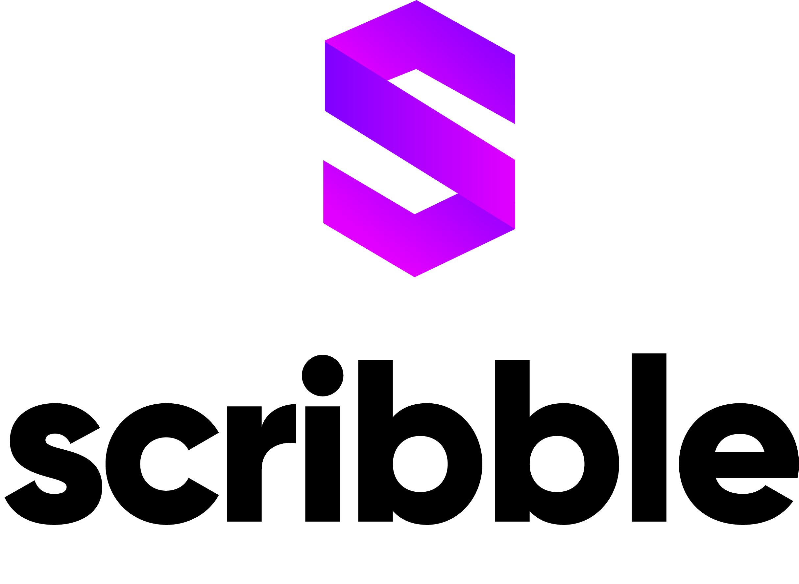

<p align="center">
  
</p>

[](https://github.com/ConsenSys/scribble/actions/workflows/node.js.yaml)
[](https://codecov.io/gh/ConsenSys/scribble)
[](https://docs.scribble.codes)
[](https://www.npmjs.com/package/eth-scribble)
[](https://www.npmjs.com/package/eth-scribble)
[](https://opensource.org/licenses/Apache-2.0)

A Solidity runtime verification tool for property based testing.

> [!TIP]
> Scribble is useful to prepare smart contracts for behavior verification with [Diligence Fuzzing](https://consensys.io/diligence/fuzzing/) or with tools, such as [Mythril](https://github.com/ConsenSys/mythril).
>
> Here are some related videos:
>
> -   [Test security properties for smart contracts & Detect vulnerabilities](https://www.youtube.com/watch?v=qn98UjcxXcQ)
> -   [Web3 Tutorial 23: Next level smart contract security with Diligence Fuzzing](https://www.youtube.com/watch?v=PmRLTXpvmMI)

## Principles and Design Goals

The design of the Scribble specification language takes inspiration from several existing
languages and we expect the language to evolve gradually as we gain more experience
in using it. We rely on the following principles and design goals to guide language
evolution:

1. Specifications are easy to understand by developers and auditors
2. Specifications are simple to reason about
3. Specifications can be efficiently checked using off-the-shelf analysis tools
4. A small number of core specification constructs are sufficient to express and reason about more advanced constructs

We are aware that this will make it difficult or impossible to express certain
properties. We encourage users to reach out if they encounter such properties. However, it
is not our itention to support every property imaginable. We consider it a great success if
Scribble is able to capture 95% of the properties that users _want_ to express.

## Usage

Install Scribble with npm:

```bash
npm install -g eth-scribble
```

Use CLI tool with the Solidity source file:

```bash
scribble sample.sol
```

Use `--help` to see all available features.

## Extension for VS Code

There is a [**Scribble extension for VSCode**](https://marketplace.visualstudio.com/items?itemName=diligence.vscode-scribble) that enhances user experience: prividing syntax highlight, hints-on-hover and other features.

Note that it is maintained in [**separate repostory**](https://github.com/ConsenSys/vscode-scribble). Report extension-related suggestions and issues there.

## Documentation

For more information on the Scribble specification language, and any other documentation, go to: [Scribble Documentation](https://docs.scribble.codes)

## Development installation

### Prerequisites

Preinstall NodeJS of [compatible version](/.nvmrc). If there is a need to run different NodeJS versions, consider using [NVM](https://github.com/nvm-sh/nvm) or similar tool for your platform.

### Clone and build

Clone repository, install and link:

```bash
git clone https://github.com/ConsenSys/scribble.git
cd scribble/
npm install
npm link
```

Prior to running the tests it would be better to setup local compiler cache:

```bash
scribble --download-compilers native wasm
```
